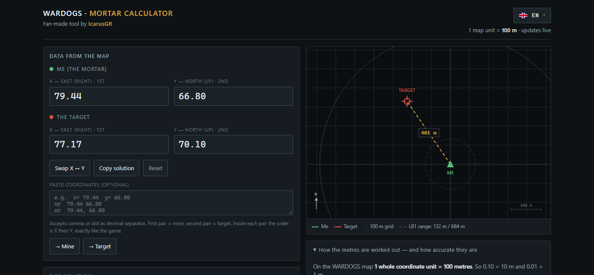

# WARDOGS — Mortar Calculator

Unofficial tool for the **WARDOGS mortar**: enter the X/Y coordinates you read off the game map and get the
**distance in metres** and the **bearing**, using the exact terms the game shows you.

> **Made by IcarusGR.** Hobby project, shared with the community for free.



- **One HTML file** — no installation, no server, **works offline**
- **7 languages**: English · Ελληνικά · Français · Deutsch · Русский · Español · Italiano
- Correct on **both axes** (diagonal), not just one
- **1 map unit = 100 metres**

---

## Download and open it

**Option 1 — grab the single file (simplest)**

1. Click **[`wardogs-mortar-calc.html`](wardogs-mortar-calc.html)**.
2. Click **`Download raw file`** (top right). You get one file, roughly 80 KB.
3. **Double-click** the downloaded file. It opens in your browser (Chrome, Edge, Firefox, Brave).
4. That's it. No internet, no account, no installation, no permissions.

**Option 2 — the whole repo as ZIP**

1. Green **`Code`** button → **`Download ZIP`**.
2. Extract the ZIP.
3. Double-click `wardogs-mortar-calc.html`.

**Option 3 — from Releases (direct download)**

Go to **[Releases](../../releases)** → download `wardogs-mortar-calc.html`.

**Option 4 — Nexus Mods**

The same tool is published as a mod page:
**[WARDOGS - Mortar Calculator on Nexus Mods](https://www.nexusmods.com/wardogs/mods/9)**.

**On a phone or tablet:** download the file, then open it from your file manager (*Open with → Chrome*).
The layout is built to work on a small screen.

---

## How to use it

1. Open the map in game. Remember: the game lists **X first, then Y**.
2. Under **"Me (the mortar)"** type the **X** and **Y** of your position.
3. Under **"The target"** type the **X** and **Y** of the target.
4. The result updates **live** — there is no calculate button:

| Reading | What it means |
|---|---|
| **Distance** (`401 m`) | This is the number you dial into the mortar's **RNG** |
| **Bearing** (`325.5° NW`) | Where to point — the same initials the map uses |
| **MILS** (`5786 mil`) | Barrel elevation in mils |
| **Δ East (X)** / **Δ North (Y)** | How far apart the two positions are on each axis |

**Shortcuts that save time**

- **Paste**: copy the coordinates exactly as you found them (`x= 79.44 y= 66.80`, or plain `79.44 66.80`),
  paste them into the box at the bottom and hit **To my position** or **To the target**.
  If you pasted them the wrong way round (Y first), the tool notices and fixes the order itself.
- **Swap X ↔ Y**: one click, for when the order keeps tripping you up.
- **Copy solution**: copies distance + bearing, ready to paste into Discord or chat.
- Accepts a **comma or a dot** as the decimal separator: `79,44` and `79.44` are the same thing.
- Your chosen language (top right, flag button) is **remembered** for next time.

---

## Where the metres come from

```
distance(m) = 100 × √( ΔX² + ΔY² )
ΔX = target X − my X
ΔY = target Y − my Y
```

On the WARDOGS map **1 full coordinate unit = 100 metres**, so the last decimal place (0.01) is **1 metre**.
`(77.94 − 77.17)` is 0.77 units = **77 metres** on the X axis.

The maths is diagonal (Pythagoras) — if you only look at one axis, you lose metres.

## Compass — the same language as the map

8 sectors × 45°. The tool shows the **English initials** (as the game does) with **your language in brackets**;
nothing is translated arbitrarily:

| Sector | Degrees | Heading |
|---|---|---|
| **N** | 337.5° – 22.5° | 0° |
| **NE** | 22.5° – 67.5° | 45° |
| **E** | 67.5° – 112.5° | 90° |
| **SE** | 112.5° – 157.5° | 135° |
| **S** | 157.5° – 202.5° | 180° |
| **SW** | 202.5° – 247.5° | 225° |
| **W** | 247.5° – 292.5° | 270° |
| **NW** | 292.5° – 337.5° | 315° |

## Languages

Top right, the flag button → menu with 7 languages. **Default page = English**; your choice is stored on your
device (localStorage) and applies on your next visit.


## How accurate is it

The distance maths is **exactly right** (12 decimals, no intermediate rounding).
In practice, what you hit is decided by the mortar's **dispersion** (~50 MOA): ±2 m at 132 m, ±10 m at 684 m.
So your first round is a **ranging shot** — measure the miss and fire again.

Ranges: **L81** (mobile mortar) 132–684 m · **SPH-2** 780–2629 m. The tool flags the result when the distance
falls outside the L81 range.

---

## License

**Creative Commons Attribution-NoDerivatives 4.0 International (CC BY-ND 4.0)** — see the [`LICENSE`](LICENSE) file.

In plain words:

- ✅ **You may use it** freely, as often as you like, and share it with others — as long as you credit the
  author (**IcarusGR**) and leave his name inside the tool.
- ✅ You may host the file, put it in your Discord, use it in your own guide, hand it to friends, upload it
  elsewhere.
- ❌ **You may not modify it** or distribute changed/derivative versions (a "my own version", edited code,
  or parts of it inside another tool).
- ❌ You may not remove or change the author's name or credits.

This tool is **unofficial** and **not affiliated** with BULKHEAD or the creators of WARDOGS.
There is no warranty of any kind — use it as it is.

Got a question, found a bug, or want to suggest something?
Open an **[Issue](../../issues)** — suggestions are welcome (changes to the code stay with the author).

---

<sub>Greek version of this page: [docs/README.el.md](docs/README.el.md)</sub>
