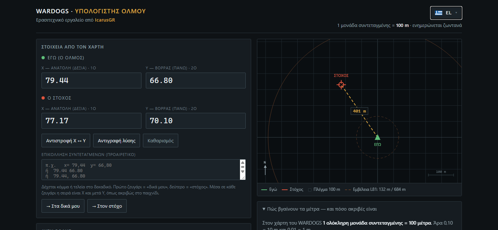
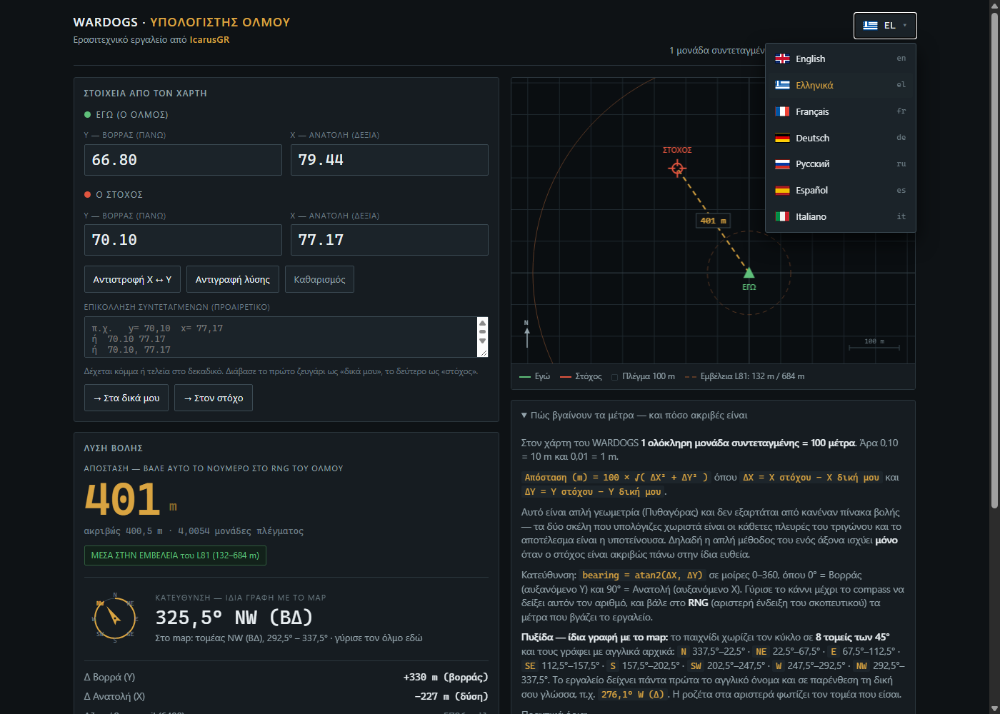

# WARDOGS — Υπολογιστής Όλμου · Mortar Calculator

> Αγγλική έκδοση αυτής της σελίδας: [README.md](../README.md)

Ανεπίσημο εργαλείο για τον **όλμο στο WARDOGS**: δίνεις τις συντεταγμένες X/Y από τον χάρτη και σου βγάζει
**απόσταση σε μέτρα** και **διόπτευση**, με την ίδια ορολογία που δείχνει το παιχνίδι.

> **Φτιαγμένο από IcarusGR.** Ερασιτεχνικό εργαλείο, μοιρασμένο δωρεάν στην κοινότητα.



- **Ένα αρχείο HTML** — καμία εγκατάσταση, κανένας server, **δουλεύει offline**
- **7 γλώσσες**: English · Ελληνικά · Français · Deutsch · Русский · Español · Italiano
- Ακρίβεια σε **δύο άξονες** (διαγώνια), όχι μόνο σε έναν
- **1 μονάδα συντεταγμένης = 100 μέτρα**

---

## Πώς να το κατεβάσεις και να το ανοίξεις

**Τρόπος 1 — κατέβασε μόνο το αρχείο (ο πιο απλός)**

1. Πάτα πάνω στο αρχείο **[`wardogs-mortar-calc.html`](../wardogs-mortar-calc.html)**.
2. Πάνω δεξιά πάτα το κουμπί **`Download raw file`** (βελάκι με γραμμή). Κατεβαίνει ένα αρχείο ~80 KB.
3. Κάνε **διπλό κλικ** στο κατεβασμένο αρχείο. Ανοίγει στον browser σου (Chrome, Edge, Firefox, Brave).
4. Τέλος. Δεν χρειάζεται internet, λογαριασμός, εγκατάσταση ή άδεια.

**Τρόπος 2 — όλο το repo σε ZIP**

1. Πράσινο κουμπί **`Code`** → **`Download ZIP`**.
2. Κάνε extract το ZIP.
3. Διπλό κλικ στο `wardogs-mortar-calc.html`.

**Τρόπος 3 — από τα Releases (κατευθείαν λήψη)**

Πήγαινα στα **[Releases](../releases)** → κατέβασε το `wardogs-mortar-calc.html`.

**Τρόπος 4 — Nexus Mods**

Το ίδιο εργαλείο υπάρχει και ως σελίδα mod:
**[WARDOGS - Mortar Calculator στο Nexus Mods](https://www.nexusmods.com/wardogs/mods/9)**.

**Σε κινητό / tablet:** κατέβασε το αρχείο, μετά άνοιξέ το από τον file manager («Άνοιγμα με → Chrome»).
Το εργαλείο έχει στηθεί να δουλεύει και σε μικρή οθόνη.

---

## Πώς το χρησιμοποιείς

1. Άνοιξε τον χάρτη στο παιχνίδι. Θυμήσου: **πρώτα το X και μετά το Y** — όπως ακριβώς σου τα δίνει το παιχνίδι.
2. Στο **«Εγώ (ο όλμος)»** γράψε το **X** και το **Y** της θέσης σου.
3. Στο **«Ο στόχος»** γράψε το **X** και το **Y** του στόχου.
4. Το αποτέλεσμα βγαίνει **ζωντανά**, χωρίς κουμπί υπολογισμού:

| Ένδειξη | Τι σημαίνει |
|---|---|
| **Απόσταση** (`401 m`) | Αυτό το νούμερο βάζεις στο **RNG** του όλμου |
| **Διόπτευση** (`325,5° NW (ΒΔ)`) | Πού γυρίζεις — με τα αρχικά που δείχνει το map |
| **MILS** (`5786 mil`) | Ανύψωση κάννης σε μίλα |
| **Δ Ανατολή (X)** / **Δ Βορρά (Y)** | Πόσο διαφέρει κάθε άξονας χωριστά |

**Κόλπα που θα σου γλυτώσουν χρόνο**

- **Επικόλληση**: αντέγραψε τις συντεταγμένες όπως τις βρήκες (`x= 79.44 y= 66.80`, ή σκέτο `79.44 66.80`),
  κόλλησέ τες στο κουτί κάτω και πάτα **«Στα δικά μου»** ή **«Στον στόχο»**.
  Αν τις κόλλησες κατά λάθος ανάποδα (Y πρώτα), το εργαλείο το καταλαβαίνει και τις διορθώνει μόνο του.
- **Αντιστροφή X ↔ Y**: αν πάντα μπερδεύεσαι με τη σειρά, πάτα αυτό το κουμπί.
- **Αντιγραφή λύσης**: αντιγράφει απόσταση + διόπτευση έτοιμα για paste σε Discord/chat.
- Δέχεται **κόμμα ή τελεία** στο δεκαδικό: `79,44` και `79.44` είναι το ίδιο.
- Η γλώσσα που διαλέγεις (πάνω δεξιά, με σημαιάκι) **θυμάται** την επόμενη φορά.

---

## Πώς βγαίνουν τα μέτρα

```
απόσταση(m) = 100 × √( ΔX² + ΔY² )
ΔX = X στόχου − X δική μου
ΔY = Y στόχου − Y δική μου
```

Στον χάρτη του WARDOGS **1 ολόκληρη μονάδα συντεταγμένης = 100 μέτρα**, δηλαδή το τελευταίο δεκαδικό ψηφίο
(0,01) είναι **1 μέτρο**. Το `(77,94 − 77,17)` είναι 0,77 μονάδες = **77 μέτρα** στον άξονα X.

Ο υπολογισμός είναι διαγώνιος (Πυθαγόρας) — αν κοιτάς μόνο τον έναν άξονα, χάνεις μέτρα.

## Πυξίδα — ίδια γλώσσα με το map

8 τομείς × 45°. Το εργαλείο δείχνει **αγγλικά αρχικά** (όπως το παιχνίδι) και **τη γλώσσα σου σε παρένθεση**,
πουθενά δεν «μεταφράζει» αυθαίρετα:

| Τομέας | Μοίρες | Καινούριος |
|---|---|---|
| **N** (Β) | 337,5° – 22,5° | 0° |
| **NE** (ΒΑ) | 22,5° – 67,5° | 45° |
| **E** (Α) | 67,5° – 112,5° | 90° |
| **SE** (ΝΑ) | 112,5° – 157,5° | 135° |
| **S** (Ν) | 157,5° – 202,5° | 180° |
| **SW** (ΝΔ) | 202,5° – 247,5° | 225° |
| **W** (Δ) | 247,5° – 292,5° | 270° |
| **NW** (ΒΔ) | 292,5° – 337,5° | 315° |

## Γλώσσες

Πάνω δεξιά, κουμπί με σημαιάκι → μενού με 7 γλώσσες. **Βασική σελίδα = αγγλικά**· η επιλογή σου αποθηκεύεται
στη συσκευή σου (localStorage) και ισχύει στην επόμενη επίσκεψη.



## Πόσο ακριβές είναι

Ο υπολογισμός αποστάσεων είναι **μαθηματικά ακριβής** (12 δεκαδικά, χωρίς στρογγυλοποίηση ενδιάμεσα).
Στην πράξη, το τι θα χτυπήσεις το ορίζει η **διασπορά** του όλμου (~50 MOA): ±2 m στα 132 m, ±10 m στα 684 m.
Άρα η πρώτη βολή είναι **βολή διόρθωσης** — μέτρα το σφάλμα και ξαναρίξε.

Εμβέλειες: **L81** (κινητός όλμος) 132–684 m · **SPH-2** 780–2629 m. Το εργαλείο σου δείχνει σήμανση όταν
η απόσταση βγει έξω από την εμβέλεια του L81.

---

## Άδεια χρήσης · License

**Creative Commons Attribution-NoDerivatives 4.0 International (CC BY-ND 4.0)** — δες το αρχείο [`LICENSE`](../LICENSE).

Με απλά λόγια:

- ✅ **Μπορείς να το χρησιμοποιήσεις** ελεύθερα, όσες φορές θέλεις, και να το μοιραστείς με άλλους —
  αρκεί να αναφέρεις τον δημιουργό (**IcarusGR**) και να μη βγάλεις το όνομά του από το εργαλείο.
- ✅ Μπορείς να βάλεις το αρχείο στον server/στο Discord/σε οδηγό σου, να το δώσεις σε φίλους, να το ανεβάσεις σε άλλο site.
- ❌ **Δεν επιτρέπεται να το τροποποιήσεις** ή να διανείμεις αλλαγμένες/παράγωγες εκδόσεις (π.χ. «δικό μου version»,
  αλλαγμένος κώδικας, κομμάτια του μέσα σε άλλο εργαλείο).
- ❌ Δεν επιτρέπεται να αφαιρέσεις ή να αλλάξεις το όνομα/τα credits του δημιουργού.

Το εργαλείο είναι **ανεπίσημο** και **δεν σχετίζεται** με τη BULKHEAD ή τους δημιουργούς του WARDOGS.
Δεν υπάρχει καμία εγγύηση — χρησιμοποίησέ το όπως είναι.

Έχεις ερώτηση, βρήκες λάθος, ή θέλεις να προτείνεις κάτι;
Άνοιξε **[Issue](../issues)** — οι προτάσεις είναι ευπρόσδεκτες (η αλλαγή του κώδικα παραμένει στον δημιουργό).
